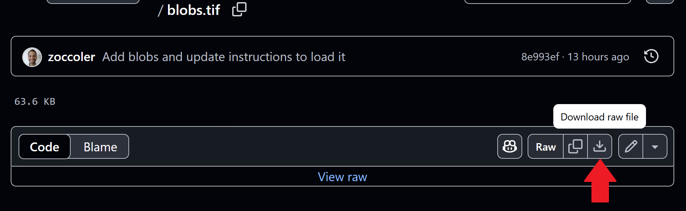

(machine_learning:pixel_classification)=
# Interactive pixel classification and object segmentation in Napari

In this exercise we will train a [Random Forest Classifier](https://en.wikipedia.org/wiki/Random_forest) for pixel classification and convert the result in an instance segmentation.
We will use the napari plugin [napari-accelerated-pixel-and-object-classification](https://www.napari-hub.org/plugins/napari-accelerated-pixel-and-object-classification).

## Getting started

Open a terminal window and activate your conda environment:

```
mamba activate napari25
```

Afterwards, start up Napari:

```
napari
```

Load the "Blobs" example dataset from data folder of this repository. You can find it [here](https://github.com/BiAPoL/BioImage-Analysis-and-Data-Processing-Workshop-2025/blob/main/data/blobs.tif). 



Drag and drop the file into the napari window.

## Pixel classification and Object Segmentation in Napari

For segmenting objects, we can use the Object Segmentation tool in APOC. 
Under the hood it uses a pixel classifier and [connected component labeling](https://en.wikipedia.org/wiki/Connected-component_labeling). 
The following procedure is also shown in [this video](apoc_object_segmentation.mp4).

Start the object segmentation from the `Tools > Segmentation / Labeling > Object Segmentation (APOC)` menu.


***Note:** If you do not see the `Object Segmentation (APOC)` menu, or get an error message, especially if you are using a Mac or a Linux system, you may need to install one of these additional packages as mentioned in the [napari-apoc installation instructions](https://github.com/haesleinhuepf/napari-accelerated-pixel-and-object-classification?tab=readme-ov-file#installation) (don't forget to activate your conda environment first):*

> Mac-users please also install this:

    conda install -c conda-forge ocl_icd_wrapper_apple

>Linux users please also install this:

    conda install -c conda-forge ocl-icd-system

Add a new labels layer by clicking on this button:


Change the brush size to a small number such as 2 or 3.


Click on the `Paint brush` button.


Start annotating the `background` region where there is no object.


Increase the label that is drawn by one.


Draw an annotation within the objects of interest. Draw background and object annotation close by each other. The closer these two annotations are drawn, the smaller is the degree of freedom the computer has when optimizing the model later.


Within the `Object segmentation` user interface on the right, select the image/channel that should be processed.


Also select the annotation label image you have just drawn.


Click on `Train`. A label image should show up.


If the segmentation works well, consider backing up the `ObjectSegmenter.cl` file that has been saved. 
If you didn't change the file location before training, it will be located in the folder from where you started napari on the command line.