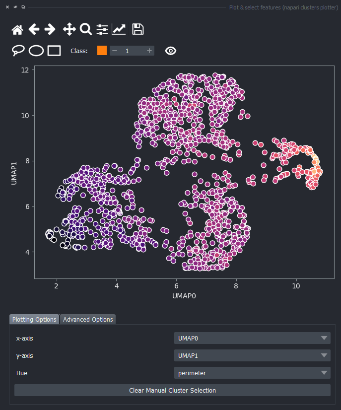
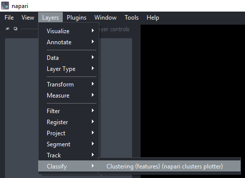

# Interactive unsupervised object classification in Napari

In this exercise we will perfom interactive feature plotting and manual selection, Dimensionality Reduction with [UMAP](https://umap-learn.readthedocs.io/en/latest/#) and Clustering with [HDBSCAN](https://hdbscan.readthedocs.io/en/latest/index.html) to assign objects (nuclei) to different classes in napari.
We will use the napari plugin [napari-clusters-plotter plugin](https://github.com/BiAPoL/napari-clusters-plotter?tab=readme-ov-file#napari-clusters-plotter).

## Getting started

Open a terminal window and activate your conda environment:

```
mamba activate napari25
```

Afterwards, start up Napari:

```
napari
```

Load the "BBBC007 v1" example dataset from the menu `File > Open Sample > napari clusters plotter > BBBC007 v1 dataset`. 


This dataset contains several images of nuclei and segmentation results with features already extracted and stored in each `Labels` layer. The dataset is from the [Broad Bioimage Benchmark Collection](https://bbbc.broadinstitute.org/BBBC007).

You should see the following layers in the napari canvas:


## Plotting Features in napari

Open the [napari-clusters-plotter](https://github.com/BiAPoL/napari-clusters-plotter?tab=readme-ov-file#napari-clusters-plotter) Plotter via `Layers > Visualize > Plot & select features (napari clusters plotter)`.


This will open a plotter. 


Change the features in the `x-axis` and `y-axis` dropdowns (like `area` and `mean_intensity`) to have them plotted against each other.


You can explore the `Avanced Options` tab to change from a scatter plot to a histogram in case there are too many points to visualize. 


For now, keep the scatter plot and go back to the `Plotting Options` tab. In the top of the plotter, you can find a few different selector buttons (`lasso`, `ellipse` and `rectangle`), a class spinbox and an eye icon to toggle the visibility of selections/clusters.

Click on the `lasso` button to have that selector enabled:


Now use the mouse to draw regions around some dots to have the corresponding objects highlighted in the main canvas. 


The color of the selected objects in the selected layer (highlighted in blue) will change to the color of the class you have selected in the spinbox. Default is class `1` (orange).


If you now select all the open layers by holding `SHIFT`and clicking on the first layer and then the last one, you will add features from all layers to the plotter. You can also select individual layers by holding `CTRL` and clicking on them. If you manually select a region again, you will see that the selected objects in all layers will change to the color of the class you have selected in the spinbox.


Besides manually classifying objects,, you can also change the `Hue` combobox to map a third feature to the color of the objects in the plotter. For example, you can select `eccentricity` or `perimeter` to have the color of the objects in the plotter represent these properties. *Notice that categorical features, like the `MANUAL_CLUSTER_ID`, have their background always highlighted.*


Close the plotter.

### Dimensionality Reduction

Apply UMAP to have all these dimensions reduced to 2. Do this via `Layers > Measure > Dimensionality reduction (features) (napari clusters plotter)`. 


Select all measurements, **except `MANUAL_CLUSTER_ID`** (while holding `SHIFT`, click on the first one, scroll down to the last one and then click on the last one). Choose `UMAP` under `Select algorithm`. Make sure to have all layers still selected.
  


Before you click on `Run`, notice that there is a small `Activity` button in the bottom right corner of the napari window. Click on it to open the `Activity` tab, and now click on `Run`. You shall see a continuous progress bar in the `Activity` tab, indicating that the UMAP algorithm is running.


After some time, new columns (`UMAP-0` and `UMAP-1`) will be added to the features. Feel free to close the dimensionality reduction widget.

### Visualize Dimensionality Reduction Results

Open the plotter again via `Layers > Visualize > Plot & select features (napari clusters plotter)` and select `UMAP-0` and `UMAP-1` in the `x-axis` and `y-axis` dropdowns. You should see a plot like this:


Click on the `eye` icon to display the previously manual selected objects onto this plot. 


You can again change the `Hue` combobox to visualize a third feature, like `perimeter` over the UMAP plot.



### Clustering

Apply HDBSCAN clustering by first opening the clustering widget via `Layers > Classify > Clustering (features) (napari clusters plotter)`. 



Select **only** `UMAP-0` and `UMAP-1` now in `Measurements` (hold `CRTL` while clicking on them). Under `Select algorithm` choose `HDBSCAN` and click on `Run`.


### Visualize Object Classification Results

Open the plotter again, plot `UMAP-0` and `UMAP-1` in the `x-axis` and `y-axis` dropdowns, and under `Clustering` choose `HDBSCAN_CLUSTER_ID`. You should see a plot like this and the corresponding objects in the napari canvas highlighted in different colors.


### Saving the Results

At the moment, you can only display and save individual tables for each `Labels` layer. This part relies on having [napari-tools-menu](https://github.com/haesleinhuepf/napari-tools-menu) and [napari-skimage-regionprops](https://github.com/haesleinhuepf/napari-skimage-regionprops) installed in the environment. To do that, go to `Tools > Measurement > Show table (nsr)`.


Choose one of the `Labels` layers and click on `Run`. You will see a table with all the features for that layer. You can save it as a CSV file by clicking on the `Save as csv...` button in the top right corner of the table.


## Conclusion

Without any ground-truth provided, we just assigned objects to different classes based on some features relationships. We just perfomed an unsupervised machine learning workflow!

## Extra Exercise

Explore the other sample datasets in the `napari clusters plotter` menu. Experiment plotting and classifying:
- `Tracks` from the `TGMM mini dataset`,
- `Surface` vertices with different curvatures from the `Cells3D mitotic nucleus surface curvature`,
- `Shapes` representing a skeleton from the `skan skeleton dataset`.